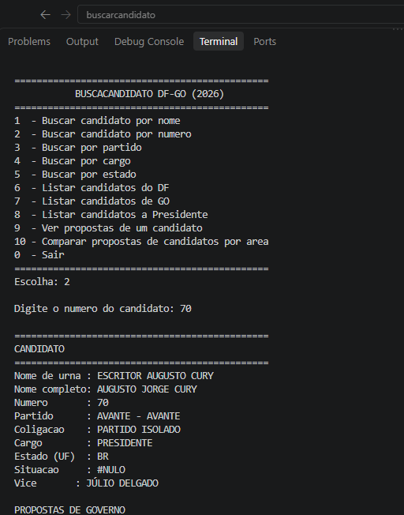

[](https://git.io/typing-svg)


 

 ---

 ## Aluno
| Matricula | Aluno           |
| --------- | --------------- |
| 221007715 | Fernanda Santos |

## Sobre  
Sistema de consulta de candidatos e propostas de governo — Eleições 2026 (Presidente, DF e GO) — construído em cima dos dados reais fornecidos pelo TSE.


## Como executar

Requer apenas Python 3.

```bash
cd G23_Busca_EDA2-2026.2
cd src
python3 main.py
```
## Estruturas de dados usadas

- **Tabela Hash**: permite a busca rápida pelo `SQ_CANDIDATO`, utilizando endereçamento aberto e sondagem linear.

- **Lista Encadeada**: armazena as propostas de governo por meio de nós encadeados criados manualmente.

- **Quicksort**: ordena os candidatos por nome, preparando os dados para a busca binária.

- **Busca Binária**: realiza buscas exatas pelo nome de urna.

- **Busca Sequencial**: realiza buscas por partido, cargo, estado e nome parcial.


## Imagens

### 1. Buscar candidato por nome


### 2. Buscar candidato por número


### 3. Buscar por partido


### 4. Buscar por cargo


### 5. Buscar por estado


### 6. Listar candidatos


### 7. Ver propostas de um candidato


### 8. Comparar propostas de candidatos por área

## Vídeo demonstrativo
[](URL_do_video)


