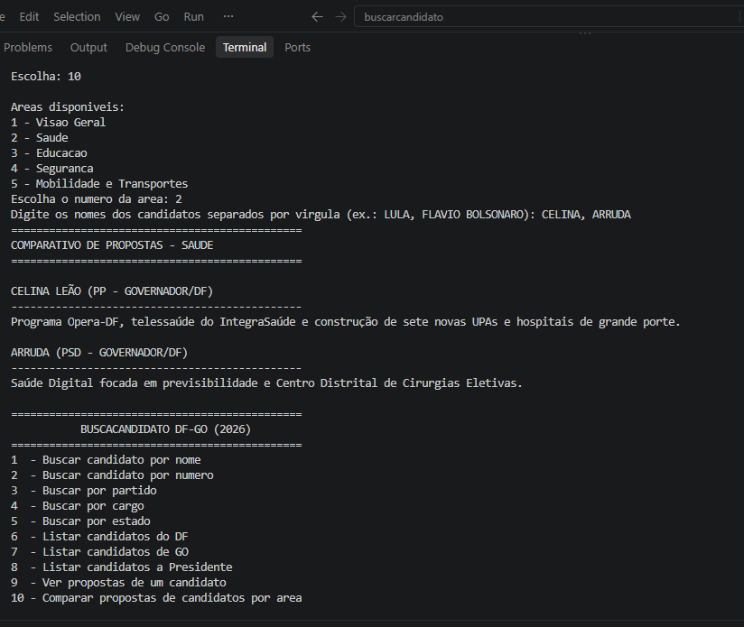

# G23_Busca_EDA2-2026.2
>Repositorio dedicado ao Trabalho 1 na turma de Estruturas de Dados 2 do 2o semestre de 2026.


## Aluno
| Matricula | Aluno           |
| --------- | --------------- |
| 221007715 | Fernanda Santos |

---

# Buscarcandidato2026

 

 ---

## Sobre  
Sistema de consulta de candidatos e propostas de governo — Eleições 2026 (Presidente, DF e GO) — construído em cima dos dados reais fornecidos pelo TSE.


## Como executar

Requer apenas Python 3.

```bash
cd buscarcandidato/src
python3 main.py
```
## Estruturas de dados usadas

- **Vetor (`list`)**: armazena os candidatos titulares. Vices e suplentes são mantidos em um índice separado.

- **Tabela Hash**: permite a busca rápida pelo `SQ_CANDIDATO`, utilizando endereçamento aberto e sondagem linear.

- **Lista Encadeada**: armazena as propostas de governo por meio de nós encadeados criados manualmente.

- **Quicksort**: ordena os candidatos por nome, preparando os dados para a busca binária.

- **Busca Binária**: realiza buscas exatas pelo nome de urna.

- **Busca Sequencial**: realiza buscas por partido, cargo, estado e nome parcial.


## Imagens 
## Buscar candidato por nome

##  Buscar candidato por numero


## Buscar por partido


##  Buscar por cargo


## Buscar por estado


## Listar candidatos 


##  Ver propostas de um candidato


## Comparar propostas de candidatos por area


## Vídeo demonstrativo
[](URL_do_video)


